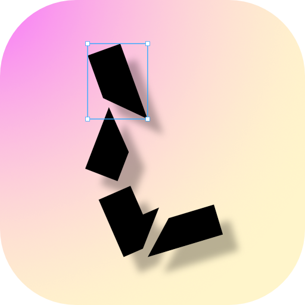
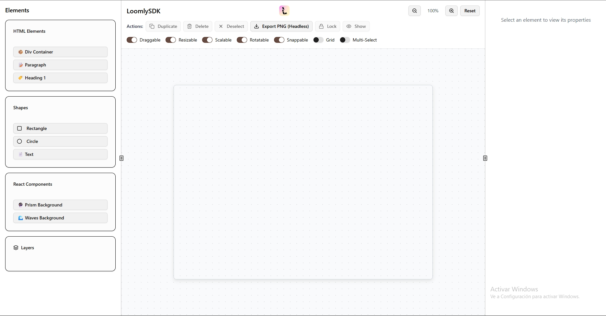
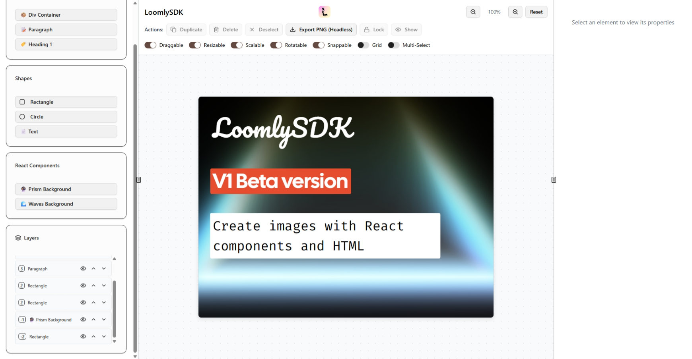

# 🎨 LoomlySDK - Visual Canvas Editor
<div align="center">

</div>
An advanced visual canvas editor built with React, TypeScript, and Moveable.js that allows you to create, manipulate, and export visual elements intuitively.

## ✨ Key Features

### 🎯 Complete Visual Editor
- **Interactive Canvas**: Resizable workspace with optional grid
- **Multiple Elements**: Support for basic HTML, geometric shapes, and React components
- **Moveable System**: Drag, resize, rotate, and scale elements with precision
- **Multi-selection**: Select and manipulate multiple elements simultaneously
- **Layers (Z-Index)**: Complete depth control, including negative values

### 🧩 Supported Element Types

#### Basic HTML
- **DIV Containers**: Flexible containers with customizable styles
- **Paragraphs (P)**: Editable text with formatting
- **Headings (H1)**: Titles with predefined styles
- **Free Text**: Text elements with inline editing

#### Geometric Shapes
- **Rectangles**: With customizable rounded corners
- **Circles**: Perfect circular shapes
- **Custom Elements**: Easy extension for new shapes

#### React Components
- **🔮 Prism Background**: Animated prism effect
- **🌊 Waves Background**: Fluid animated waves
- **Extensible System**: Easy addition of new React components

# Screenshots




### 🛠️ Manipulation Tools

#### Viewport Controls
- **Zoom**: Zoom in/out (10% - 300%) with precise controls
- **Visual Grid**: Optional alignment guides
- **Smooth Navigation**: Fluid canvas scrolling

#### Element Operations
- **Duplicate**: Clone elements with automatic offset
- **Delete**: Remove selected elements
- **Lock/Unlock**: Protect elements from modifications
- **Show/Hide**: Toggle visibility without deletion

#### Layer Management
- **Move Layers Up/Down**: Granular Z-order control
- **Custom Z-Index**: Positive and negative values
- **Layers Panel**: Organized view of all elements

### 🎨 Properties System

#### Style Editor
- **Dimensions**: Width, height with flexible units
- **Positioning**: Precise coordinate control
- **Appearance**: Colors, borders, shadows, opacity
- **Typography**: Fonts, sizes, weights, alignment
- **Transformations**: Rotation, scale, skew

#### Moveable Configuration
- **Selective Controls**: Enable/disable specific operations
- **Constraints**: Movement and resizing restrictions
- **Snapping**: Automatic alignment to grids and guides
- **Performance**: Configurable throttling for smooth operations

### 🚀 Advanced Export System

#### Automated Process
1. **HTML Extraction**: Complete canvas content capture
2. **Component Detection**: Automatic React element identification
3. **Code Generation**: Automatic TypeScript file creation
4. **Chrome Rendering**: Real browser capture via Puppeteer
5. **PNG Download**: High-quality final image

#### Export Features
- **Configurable Resolution**: Quality and size adjustment
- **Transparency**: Optional transparent backgrounds
- **Integrated Components**: Functional React components export
- **Preserved Styles**: Exact CSS maintenance

### 🏗️ System Architecture

#### Frontend (React + TypeScript)
```
src/
├── components/          # UI Components
│   ├── Studio.tsx      # Main editor
│   ├── Canvas.tsx      # Work area
│   ├── Elements.tsx    # Elements panel
│   ├── Toolbar.tsx     # Toolbar
│   ├── Properties.tsx  # Properties panel
│   └── Layers.tsx      # Layer management
├── config/             # Centralized configuration
│   └── ComponentsConfig.ts  # Component registry
├── services/           # Business logic
│   ├── ComponentRegistry.ts # React component registry
│   ├── CanvasExtractor.ts   # Content extraction
│   └── ComponentGenerator.ts # Code generation
└── hooks/              # Custom hooks
    └── useCanvasComponentDetector.ts
```

#### Backend (Express + Puppeteer)
```
server/
└── index.js           # Rendering server
    ├── /api/test      # Health check
    ├── /api/generate-component  # File generation
    └── /api/capture-screenshot  # Chrome capture
```

### 📦 Technologies Used

#### Core
- **React 18**: Modern UI framework with hooks
- **TypeScript**: Static typing for better development
- **Vite**: Ultra-fast build tool with HMR
- **Tailwind CSS**: Utility-first CSS for consistent UI

#### Functionality
- **Moveable.js**: Element manipulation library
- **React DOM**: Dynamic React component rendering
- **Puppeteer**: Browser automation for captures

#### Backend
- **Express**: Minimalist web server
- **CORS**: Cross-origin request enablement
- **Chrome/Chromium**: Rendering engine for exports

## 🚀 Installation and Usage

### Prerequisites
- Node.js 18+ 
- npm or yarn
- Chrome/Chromium installed

### Installation
```bash
# Clone repository
git clone <repository-url>
cd LoomlySDK

# Install dependencies
npm install

# Install server dependencies
npm run dev:full
```

### Development
```bash
# Terminal 1: Frontend (Port 5173)
npm run dev

# Terminal 2: Backend (Port 3001)  
cd server && npm start
```

### Access
- **Editor**: http://localhost:5173
- **Render View**: http://localhost:5173/render
- **Backend API**: http://localhost:3001

## 🎯 Workflow

### 1. Create Canvas
- Configure initial dimensions
- Set zoom and configurations

### 2. Add Elements
- Select from Elements panel
- Position on canvas
- Configure properties

### 3. Design and Organize
- Manipulate with Moveable controls
- Adjust layers and visibility
- Apply custom styles

### 4. Export Result
- Use "Export PNG" button
- Automatic final image download
- ComponentRendered.tsx file generated

## 🔧 Component Configuration

### Adding New React Component
Edit `src/config/ComponentsConfig.ts`:

```typescript
// 1. Import component
import MyComponent from '@/components/MyComponent';

// 2. Add configuration
MyComponent: {
    name: 'MyComponent',
    displayName: '🎨 My Component',
    category: 'ui',
    component: MyComponent,
    importPath: '@/components/MyComponent',
    defaultProps: { text: 'Example' },
    size: { width: 200, height: 100 }
}
```

The component will automatically appear in the Elements panel.

## 📁 Generated File Structure

### Complete Export
```
src/render/
└── ComponentRendered.tsx    # Generated React component
    ├── Automatic imports     # Component paths
    ├── Extracted styles      # Canvas CSS
    ├── Preserved HTML        # Static content
    └── Positioned components # React components
```

## 🤝 Contributing

1. Fork the project
2. Create feature branch (`git checkout -b feature/AmazingFeature`)
3. Commit changes (`git commit -m 'Add AmazingFeature'`)
4. Push to branch (`git push origin feature/AmazingFeature`)
5. Open Pull Request 

## 📄 License

This project is licensed under the MIT License. 
